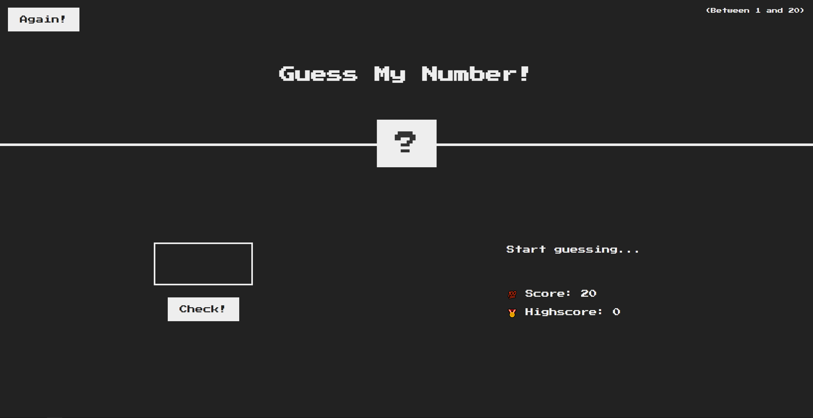

# Retro Game - Guess My Number

Retro Game, also known as Guess My Number, is a simple game where the user tries to guess the number chosen by the computer within a specified range.

## About the Project

This project is part of the "The Complete JavaScript Course 2024: From Zero to Expert!" course created by Jonas Schmedtmann. The purpose of this project is to demonstrate basic JavaScript concepts such as conditionals, loops, user input handling, and random number generation. Some key features of the project include:

- Generating a random number for the user to guess
- Providing feedback to the user on whether their guess is too high or too low
- Allowing the user to input their guess and submit it
- Displaying the number of attempts made by the user
- Ending the game and displaying the correct number when the user guesses correctly

## How to Run the Project

1. Download or clone this repository to your computer.
2. Open the `index.html` file in your web browser.

## Live Demo

Check out the live demo of the project on Netlify: [Retro Game Demo](https://retro-game-trpimir.netlify.app/).

## Author

This project is part of the "The Complete JavaScript Course 2024: From Zero to Expert!" course created by Jonas Schmedtmann.

## License

This project is available under the MIT license. For more information, see the `LICENSE` file.
